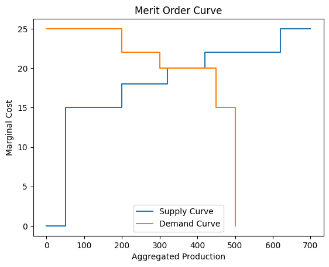

# Merit Order Curve

Ce projet implémente une classe Python appelée `MeritOrderCurve` qui permet de générer une merit order curve afin d'obtenir le clearing price. 



## Installation

1. Clonez le dépôt sur votre machine locale,
   ```bash
   git clone https://github.com/SarcasticMatrix/merit-order-curve.git
   cd merit-order-curve
   ```
   Sinon, vous pouvez juste copier coller le code de `meritOrderCurve.py`,

2. Puis, installez les libraries,
   ```bash
   pip install -r requirements.txt
   ```

# Utilisation

Créez des `np.array` représentant les **productions**, les **bids de production**, les **demandes** et les **bids de demande**. Attention, il faut que tout soit dans la même unité. 

Soit vous importer le fichier python `meritOrderCurve`,
```python
from meritOrderCurve import MeritOrderCurve
import numpy as np
```
Ou alors, vous pouvez directement écire dans le fichier en lui même (comme pour les 2 exemples)

- Exemple d'utilisation dans un cas classique,  
```python
prod = np.array([100, 100, 200, 50, 100, 50])       # production
prod_bids = np.array([-25, -30, 10, 80, 40, 70])    # production bids

demands = np.array([250, 50, 70])                   # demand
demands_bids = np.array([200, 60, 300])             # demand bids

curve = MeritOrderCurve(prod, prod_bids, demands, demands_bids)
curve.merit_order_curve()                           # plot the merit order curve
```

- Exemple avec une demande constante, il faut juste préciser `boolean_cst_demand=True`,
```python

prod = np.array([100, 100, 200, 50, 100, 50])
prod_bids = np.array([-25, -30, 10, 80, 40, 70])

demands = np.array([50])

curve = MeritOrderCurve(prod, prod_bids, demands, boolean_cst_demand=True)
curve.merit_order_curve()
```

# Auteur
Théophile SCHMUTZ