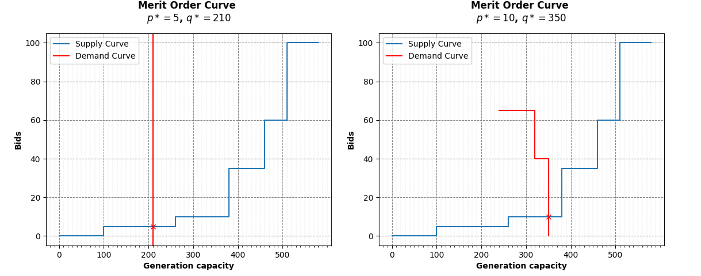

# Merit Order Curve

This humble project implements a Python class called `MeritOrderCurve` that generates a merit order curve to determine the clearing price $p^*$.



## Installation

1. Clone the repository to your local machine,
   ```bash
   git clone https://github.com/SarcasticMatrix/merit-order-curve.git
   cd merit-order-curve
   ```

2. Install the required libraries,
   ```bash
   pip install -r requirements.txt
   ```

# Usage

Import the Python file meritOrderCurve,
```python
from meritOrderCurve import MeritOrderCurve
import numpy as np
```
Then, create `np.array` representing **productions**, **production bids**, **demands**, and **demand bids**. Note that everything should be in the same unit.

- Example of use in a typical case, 
```python
prod = np.array([70,50,80,120,160,100])             # production
prod_bids = np.array([100,60,35,10,5,0])            # production bids

demands = np.array([140,80,100,30])                 # demand
demands_bids = np.array([np.inf,65,np.inf,40])      # demand bids

curve = MeritOrderCurve(prod, prod_bids, demands, demands_bids)
curve.merit_order_curve()                           # plot the merit order curve
```

- Example with constant (inelastic) demand, just specify boolean_cst_demand=True,
```python

prod = np.array([70,50,80,120,160,100])
prod_bids = np.array([100,60,35,10,5,0])

demands = np.array([210])

curve = MeritOrderCurve(prod, prod_bids, demands, boolean_cst_demand=True)
curve.merit_order_curve()
```

# Author
Théophile SCHMUTZ